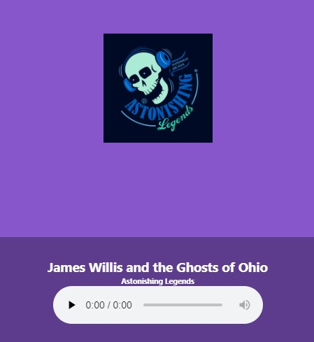

# App podcasts

## ¿Cómo funciona?

Require NodeJS >=10

* `npm install` para instalación de dependencias
* `npm run dev` para ejecutar el entorno de desarrollo
* `npm run build && npm start` para ejecutar el entorno de producción

##Licencia

MIT